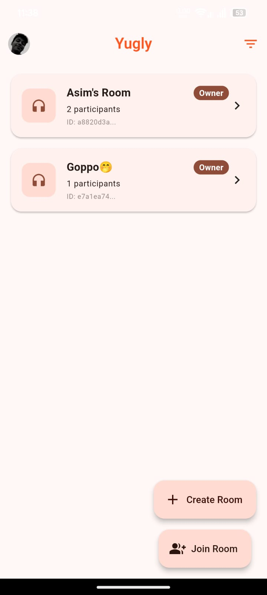
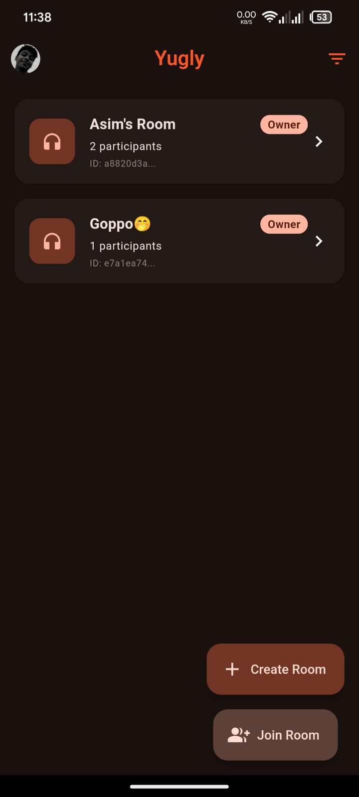
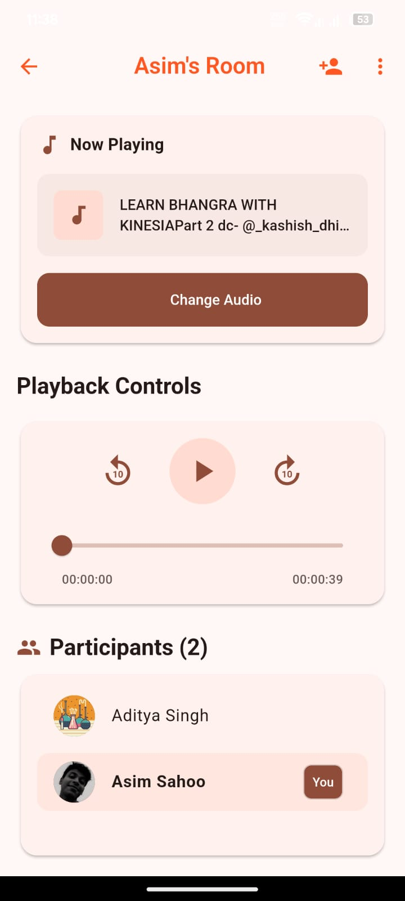
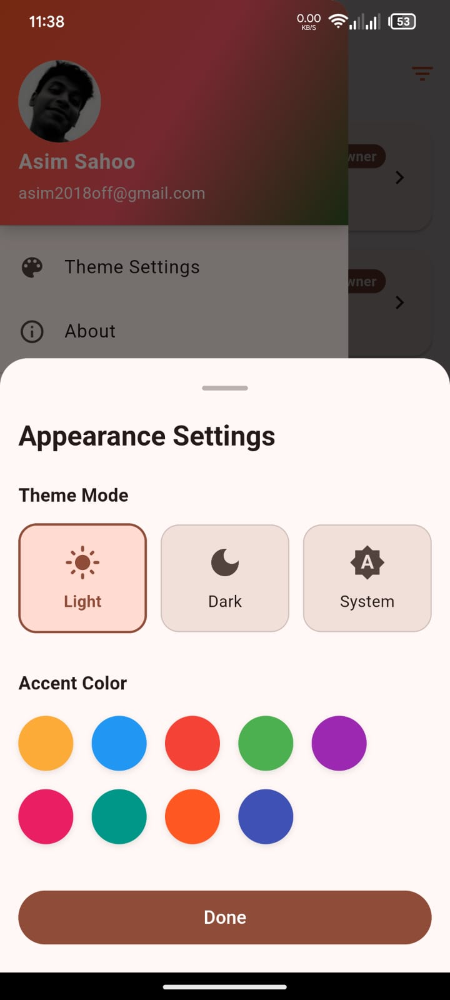
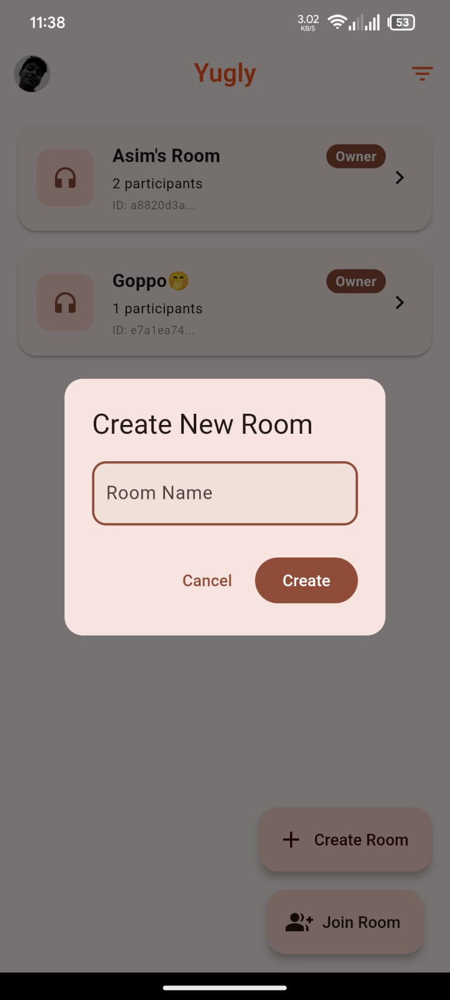

# Yugly

Yugly is a real-time audio sharing application that allows users to create or join listening rooms and enjoy synchronized audio playback with friends and family. The app supports both light and dark themes, customizable accent colors, and seamless integration with Firebase for authentication, storage, and real-time database functionality.

## Features

### Authentication
- **Email/Password Authentication**: Sign up or log in using email and password.
- **Google Sign-In**: Easily log in with your Google account.
- **Session Persistence**: Automatically remembers your login session.

### Listening Rooms
- **Create Rooms**: Start a new listening room with a custom name.
- **Join Rooms**: Join existing rooms using a unique room ID.
- **Room List**: View all rooms you've created or joined, with filtering options.
- **Room Sharing**: Share room details with others using the native share dialog.

### Audio Playback
- **Upload Audio**: Upload audio files to the room for synchronized playback.
- **Synchronized Playback**: All participants in a room listen to the same audio in sync.
- **Playback Controls**: Play, pause, and seek audio playback.
- **Real-Time Sync**: Automatically adjusts playback to ensure synchronization.

### Participant Management
- **Real-Time Updates**: See who is currently in the room.
- **Participant Permissions**: Room owners can allow or restrict participants from controlling playback.
- **Leave Room**: Participants can leave the room at any time.

### User Interface
- **Light and Dark Themes**: Supports both light and dark modes.
- **Customizable Accent Colors**: Personalize the app's appearance with your favorite color.
- **Pull-to-Refresh**: Refresh the room list with a simple swipe gesture.

## Coming Soon

- **In-App MP3 Downloads**: Users will be able to download MP3 files directly within the app without visiting external websites.
- **Participant Playback Control**: Room hosts will have the option to grant playback control to participants, allowing for a more collaborative listening experience.
- **Advanced Queue Management**: Create and manage playlists for your listening rooms.
- **Room Categories**: Organize and discover rooms by music genre or content type.

## Screenshots


*Login screen with email and Google sign-in options*


*Home screen showing available listening rooms in light theme*


*Home screen showing available listening rooms in dark theme*


*Active listening room with playback controls and participant list*


*Theme customization options with various accent colors*


*Creating a new listening room with custom name*

## Getting Started

### Prerequisites
- Install [Flutter](https://flutter.dev/docs/get-started/install) on your system.
- Set up Firebase for your project:
  - Enable Firebase Authentication, Realtime Database, and Storage.
  - Add your `google-services.json` (for Android) and `GoogleService-Info.plist` (for iOS) files to the respective directories.

### Installation
1. Clone the repository:
   ```bash
   git clone https://github.com/asim-sahoo/yugly.git
   cd yugly
   ```
2. Install dependencies:
   ```bash
   flutter pub get
   ```
3. Run the app:
   ```bash
   flutter run
   ```

## Dependencies
The app uses the following key dependencies:
- `firebase_auth`: For authentication.
- `google_sign_in`: For Google login.
- `firebase_database`: For real-time database functionality.
- `firebase_storage`: For storing audio files.
- `just_audio`: For audio playback.
- `file_picker`: For selecting audio files.
- `provider`: For state management.
- `pull_to_refresh`: For pull-to-refresh functionality.
- `share_plus`: For sharing room details.

For a full list of dependencies, see the `pubspec.yaml` file.

## Contributing
Contributions are welcome! Please follow these steps:
1. Fork the repository.
2. Create a new branch for your feature or bug fix.
3. Commit your changes and push them to your fork.
4. Submit a pull request.


## Acknowledgments
- Built with ❤️ using Flutter.
- Firebase for backend services.
- Inspired by the idea of bringing people together through shared audio experiences.
